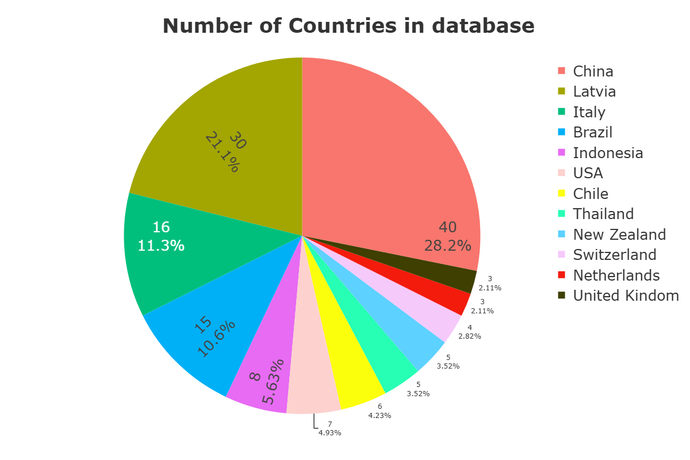
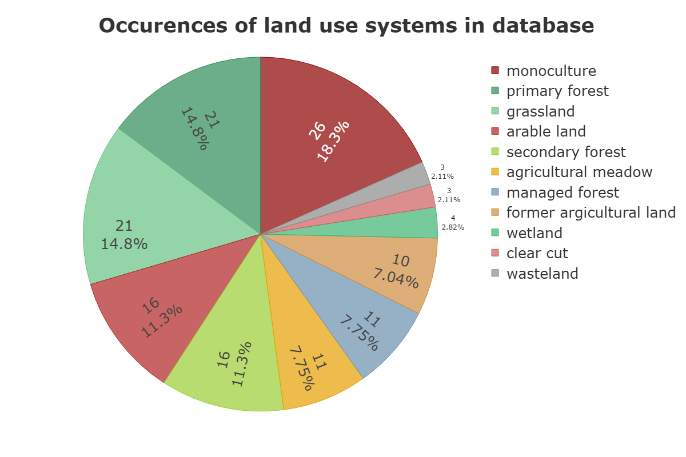
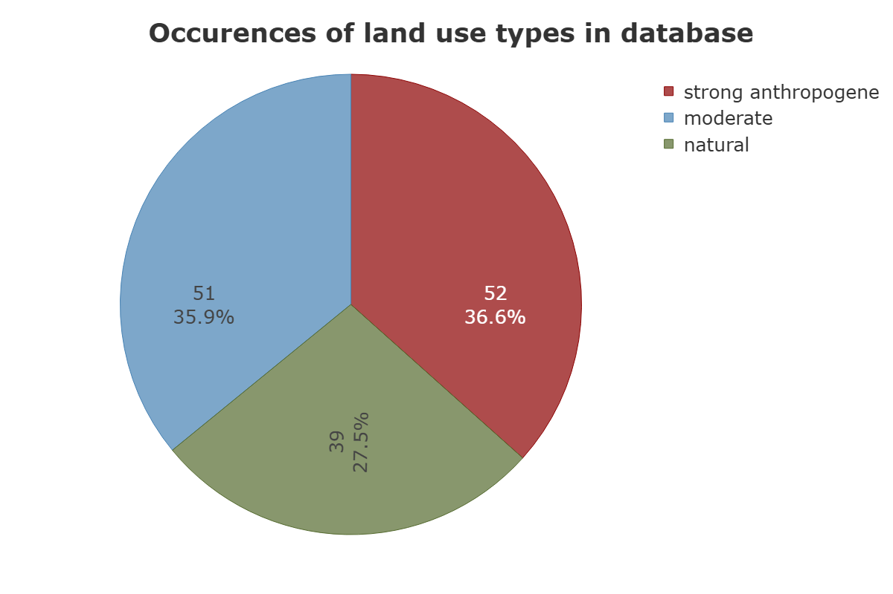
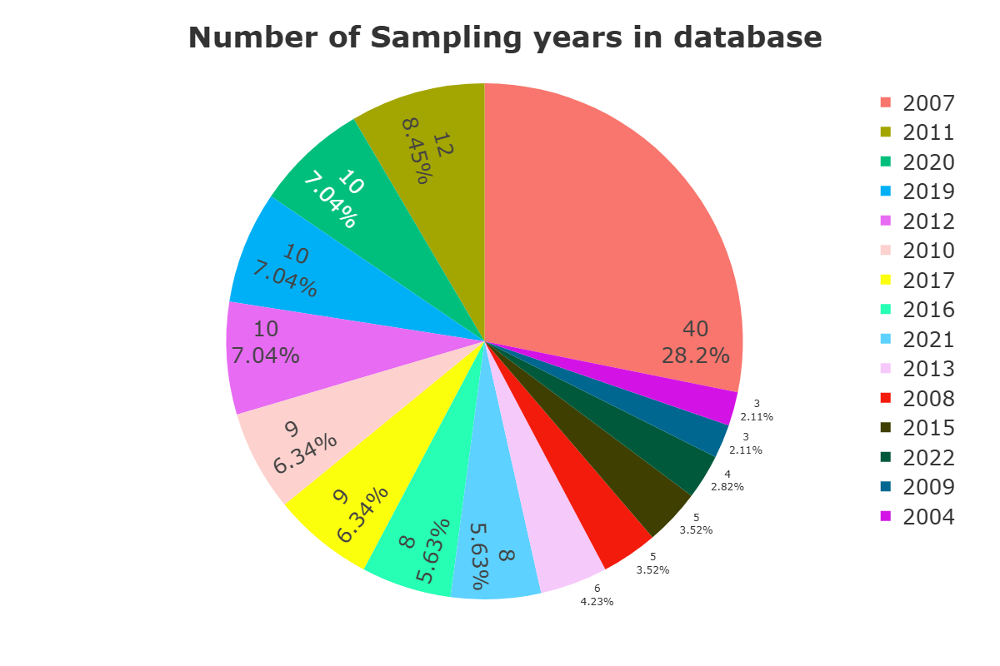

# Large-scale Land-Use Effects on Soil Fungal Diversity

Student research project investigating global patterns of soil fungal diversity using quantitative meta-analysis, statistical modeling, and reproducible workflows.

---

## Project Overview

This repository contains the data, code, and analysis workflow used in a student research project examining how land use, climate, seasonality, and soil depth influence soil fungal diversity at a global scale.

The project is based on a meta-analysis of published studies and integrates molecular, ecological, and environmental data to evaluate large-scale patterns in fungal α-diversity.

The study was conducted as part of an academic degree program and aims to support transparent and reproducible research.

---
## Research Objectives

The main objectives of this project were:

- To evaluate global patterns of soil fungal diversity across different land-use intensities
- To assess the influence of climatic variables and seasonal variation
- To examine depth-related changes in fungal communities
- To identify methodological and analytical sources of variation among studies
- To assess the robustness of commonly used diversity metrics in meta-analytical contexts

---
## Summary of Main Findings

This meta-analysis indicates that soil fungal diversity is shaped more strongly by spatial and temporal context than by land-use type alone.

Key findings include:

- Land-use categories were not consistent predictors of Shannon diversity or relative OTU richness.
- Simpson diversity showed associations with land-use types, but without stable directional contrasts, suggesting substantial between-study heterogeneity.
- Broad climate zones did not consistently explain diversity patterns, whereas continent-level differences were more pronounced.
- Sampling season emerged as the most consistent correlate of fungal diversity across metrics.
- Depth-related effects were weak and did not follow a uniform vertical gradient.

Overall, broad land-use labels alone do not reliably predict large-scale fungal α-diversity. Instead, where and when soils are sampled appears to be more influential than land-use intensity per se.

---
## Dataset Overview

The compiled database integrates published studies from multiple regions, land-use systems, and sampling periods. The following figures summarize the structure of the dataset.

### Distribution of Studies by Continent

### Distribution of Studies by Country

### Distribution of Land-Use Systems

### Distribution of Land-Use Intensity Classes

### Distribution of Sampling Years

These figures illustrate the geographic, ecological, and temporal coverage of the dataset and highlight potential imbalances in regional representation and land-use categories.

---
## Repository Contents

This repository includes:

- A Jupyter Notebook containing the complete data processing and analysis workflow
- Statistical analyses including significance tests and effect size calculations
- The compiled meta-analysis dataset derived from published literature
- Figures and visualizations used in the manuscript
- Supplementary tables summarizing statistical results

All analyses can be reproduced using the provided data and code.

---

## Repository Structure

- `data/` : Compiled dataset and statistical results  
- `img/` : Figures and visualizations  
- `analysisDatabase.ipynb` : Main analysis notebook for data processing, statistics, and plotting  

---
## Methodological Scope

The database synthesizes studies reporting fungal diversity using indices such as:

- Shannon diversity
- Relative OTU richness
- Simpson diversity

Included studies differ in sampling design, molecular markers, sequencing platforms, and bioinformatic pipelines. These methodological differences were explicitly considered when interpreting results.

The analysis focuses on α-diversity patterns and does not directly assess β-diversity or functional guild composition.

---
## Reproducibility

All figures, statistical analyses, and summary tables presented in this project can be reproduced by running the main Jupyter Notebook using the provided dataset.

Dependencies and workflow steps are documented within the notebook.

---
## License and Usage

This repository is intended for academic and non-commercial use.

Please cite the original studies and this project when using the data, code, or derived results.

---
## Acknowledgements

This project was conducted as part of an academic degree program.

We thank the authors of the original studies for making their data publicly available and thereby enabling large-scale synthesis.
